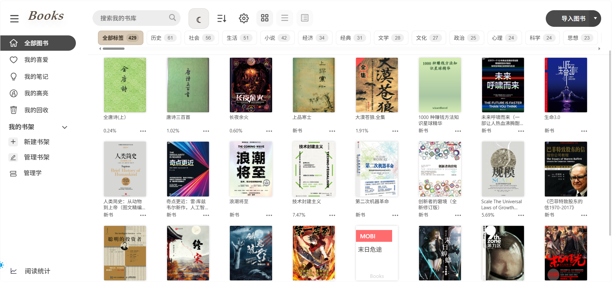
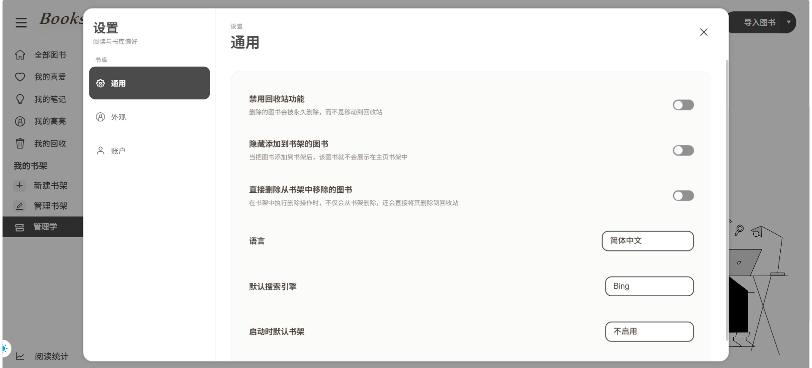

<div align="center">

# 📚 Books

**一个可以自己部署的开源网页书库**

基于 [Koodo Reader](https://github.com/koodo-reader/koodo-reader) 改造，保留顶级阅读体验，新增**中心化书库 / 多用户权限 / 豆瓣元信息 / 本地封面**。用 Docker 一键部署，几分钟就能把你所有的电子书“搬上云”。

[](LICENSE)
[](https://github.com/koodo-reader/koodo-reader)
[](https://www.docker.com/)

</div>

---

## 这是什么？

Books 是一个**自托管的网页书库**：你把自己的电子书放在服务器上，然后在浏览器里登录，就能**阅读、管理、下载**。

它把 Koodo Reader 的阅读内核（目录、笔记、高亮、翻页、多主题）搬到了网页上，额外加了服务端书库、多用户、图书权限、豆瓣元信息、封面本地保存、标签筛选等功能。

> **English** — Books is a self-hosted, open-source web book library built on top of [Koodo Reader](https://github.com/koodo-reader/koodo-reader). Keep all your ebooks on your own server, then read, manage and download them from any browser. It adds a centralized library, multi-user permissions, Douban metadata and local covers on top of Koodo's polished reading experience.

## 为什么用 Books？（可以取代 talebook）

如果你之前用的是 [talebook](https://github.com/talebook/talebook) 或者 Calibre 的网页版，Books 会是一个更现代、更顺手的选择：

| 对比 | talebook / Calibre-web | **Books** |
| --- | --- | --- |
| 阅读体验 | 一般 | 细腻（Koodo 内核、翻页/笔记/高亮/多主题） |
| 安装依赖 | 需要 Calibre，较重 | 单一 Docker 镜像，轻量 |
| 界面 | 偏传统 | 现代、清爽、支持明暗主题 |
| 多用户 | 需要额外配置 | 内置，支持按用户控制权限 |
| 元信息 | 手动 | 一键从豆瓣补齐书名/作者/评分/封面 |

适合这些场景：

- 🏠 家中 NAS 上放一个统一书库
- 💻 多台电脑、手机、平板共用一个网页阅读入口
- 👥 管理员上传图书，普通用户只看自己有权限的书
- 📖 阅读进度、笔记、高亮统一管理，换个设备也能接着看

## 截图

| 书库首页 | 书籍详情（豆瓣元信息） |
| --- | --- |
|  |  |

| 阅读界面 | 设置 |
| --- | --- |
|  |  |

---

## 🚀 快速开始（Docker，小白友好）

> 只需要装好 [Docker](https://www.docker.com/)（自带 `docker compose`）。下面三步就能跑起来。

### 方式一：Docker Compose（最推荐⭐）

在项目根目录执行：

```bash
# 1. 设置登录密码（写到 .env，不会上传到 github，git 已忽略）
echo "SERVER_PASSWORD=在这里填一个强密码" > .env

# 2. 启动
docker compose up -d
```

> - 没有设置 `SERVER_PASSWORD` 的话，服务会**拒绝启动**——这是故意的，防止你用一个“默认密码”裸奔。
> - 首次 `docker compose up -d` 会**自动从源码构建镜像**（需要几分钟、且能访问网络下载基础镜像）。以后重新起来就很快。
> - 如果以前设过密码、想换，改 `.env` 再 `docker compose up -d` 即可。

启动后，用浏览器打开：

```text
http://你的服务器IP:18083
```

- 默认账号：`admin`
- 密码：就是你刚才设置的 `SERVER_PASSWORD`

> 你的书库数据默认存在 `./data/uploads`（就在 docker-compose.yml 所在目录）。想换地方，在 `.env` 里写：
> ```
> BOOKS_DATA_DIR=/你想放的绝对路径
> ```

### 方式二：自己构建 + docker run（手动版）

不想用 compose 的话，先构建镜像再运行：

```bash
# 1. 构建镜像（首次要几分钟，并需能访问网络下载基础镜像）
docker build -t koodo-centralized:local .

# 2. 运行
docker run -d \
  --name books \
  --restart unless-stopped \
  -p 18083:8080 \
  -e SERVER_USERNAME=admin \
  -e SERVER_PASSWORD="在这里填一个强密码" \
  -e ENABLE_HTTP_SERVER=true \
  -e ENABLE_LIBRARY_SERVER=true \
  -e ENABLE_OPDS=true \
  -e STATIC_DIR=/app/build \
  -e PORT=8080 \
  -v "$(pwd)/data/uploads:/app/uploads" \
  koodo-centralized:local
```

> 记得把 `$(pwd)/data/uploads` 换成一个你真正想放书库的目录。

---

## 🔐 环境变量

用 Docker Compose 时常用到的配置：

| 变量 | 默认值 | 说明 |
| --- | --- | --- |
| `SERVER_USERNAME` | `admin` | 登录用户名 |
| `SERVER_PASSWORD` | **无（必填）** | 登录密码；未设置会拒绝启动 |
| `SERVER_PASSWORD_FILE` | 空 | 改为 Docker Secret 文件名，密码改从 `/run/secrets/<名>` 读取（见下方进阶） |
| `ENABLE_HTTP_SERVER` | `true`（镜像内置） | 是否开启图书文件服务/上传下载 |
| `ENABLE_LIBRARY_SERVER` | `true` | 是否开启中心化书库服务 |
| `ENABLE_OPDS` | `true`（镜像内置） | 是否开启 OPDS 目录（需同时开启 HTTP server） |
| `ENABLE_KOREADER_SERVER` | `false` | 是否开启 KOReader 同步服务 |
| `ENABLE_KOREADER_REGISTRATION` | `true` | 是否允许 KOReader 注册新设备 |
| `PORT` | `8080` | Go 服务监听端口（容器内） |
| `STATIC_DIR` | `/app/build` | 前端构建产物目录 |
| `KOREADER_PORT` | `7200` | KOReader 同步端口 |
| `ALLOWED_ORIGINS` | 空（全放行） | 允许的跨域来源，逗号分隔；有安全需求建议设置 |
| `BOOKS_DATA_DIR` | `./data/uploads` | （仅 compose）书库数据在宿主机上的存放目录 |

> 进阶：想让密码更安全，可以用 Docker Secret 而不是环境变量，见下面的「进阶」小节。

---

## 🔒 进阶：用 Docker Secret 管理密码（可选）

默认把密码写进环境变量（`docker ps` 能看到）。如果你不想这样，可以用 Docker Secret：

```bash
# 1. 生成密码文件（内容就是你的强密码）
echo "你的强密码" > my_secret.txt

# 2. 用带 Secret 的 compose 启动
docker compose -f docker-compose-secret.yml up -d
```

这样密码会从 `/run/secrets/books_admin_password` 读取，不会出现在环境变量里。`my_secret.txt` 已被 git 忽略，不会被提交。

---

## 💾 数据放在哪里

容器里统一用一个目录：

```text
/app/uploads
```

推荐挂载到宿主机（compose 默认映射到 `./data/uploads`）。目录结构大概是这样：

```text
你设置的数据目录/
├── book/      # 书籍文件
├── cover/     # 封面文件
└── config/    # 数据库、配置、笔记、阅读进度
```

**只要这个目录不删，重建容器、升级版本后，书、账号、笔记、进度都还在。**

---

## 📖 OPDS（给第三方阅读器用）

支持 OPDS 目录，能让 iOS/Android 上的阅读器（如 Apple Books、KOReader、Legado 等）直接浏览你的书库：

```text
http://你的服务器IP:18083/opds
```

---

## 🔄 如何更新

```bash
# 停止并删除旧容器（数据不会丢，只要你不删数据目录）
docker compose down

# 重新拉/构建并启动
docker compose up -d
```

只要数据目录还在，升级后书库内容原样保留。

---

## 🛠 本地开发（给想改代码的朋友）

```bash
# 安装依赖
corepack enable
pnpm install

# 启动前端开发服务（默认 http://127.0.0.1:3000）
pnpm start

# 构建前端
pnpm build

# 启动 Go 后端（另一个终端）
cd httpserver
STATIC_DIR=../build ENABLE_HTTP_SERVER=true ENABLE_LIBRARY_SERVER=true ENABLE_OPDS=true PORT=8080 go run .

# 跑 Go 测试
cd httpserver
go test ./...
```

---

## 🙏 致谢

Books 不是从零写的，感谢这些优秀的开源项目：

- **[Koodo Reader](https://github.com/koodo-reader/koodo-reader)** — 本项目的基础与阅读内核，保留了它出色的阅读体验。
- **[talebook](https://github.com/talebook/talebook)** — 同类自托管书库项目，给了我们“如何做得更好”的方向。
- **[douban-api-rs](https://github.com/cxfksword/douban-api-rs)** — 内置的豆瓣封面兜底代理。

---

## ⚖️ License

本项目基于 [GNU Affero General Public License v3.0](LICENSE)（AGPL-3.0）开源。使用、修改、分发请遵守该协议；涉及网络服务端时，请同样以 AGPL-3.0 开放源码。

---

<div align="center">

**Books** · 让你的电子书，随处可读 📖

</div>
